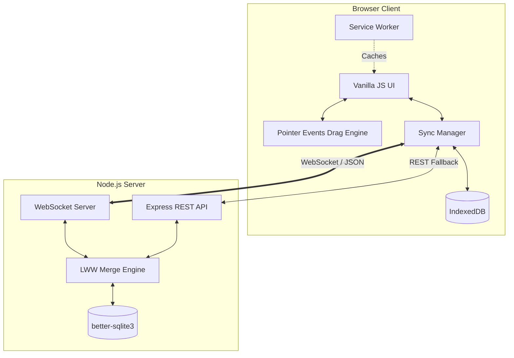

# Collaborative Distributed Kanban Board

## The Why
Building a high-performance, fully offline-capable collaborative tool is one of the most challenging engineering tasks. This project demonstrates advanced capabilities in web architecture:
- **Offline-first Architecture**: Users should be able to create, move, and edit cards even on a train with zero connectivity. When connection is restored, background syncing handles state merging seamlessly.
- **Real-Time Collaboration**: Instant WebSocket updates let teams work together without layout thrashing or stale data.
- **60fps Native-feeling Drag & Drop**: Using the raw Pointer Events API and GPU-accelerated CSS (`transform: translate3d`) avoids the jank and limitations of the standard HTML5 Drag and Drop API.

## Architecture Diagram

## Trade-offs
1. **LWW (Last-Write-Wins) vs Full CRDT**: A full CRDT engine requires significant complexity and memory overhead. For a Kanban board, LWW on discrete fields (title, orderIndex, columnId) via `updatedAt` timestamps provides 95% of CRDT benefits with 5% of the code.
2. **Pointer Events vs HTML5 DnD**: HTML5 DnD creates ghost images that are hard to style and often feels sluggish. Re-implementing dragging with Pointer Events gives complete control over styling, rotation effects, and ensures we can lock dragging to 60fps via `requestAnimationFrame` and GPU compositing.
3. **IndexedDB vs localStorage**: `localStorage` is synchronous and blocks the main thread, which ruins 60fps animations. IndexedDB is asynchronous and handles complex object storage natively, making it perfect for our offline-first approach.

## Quick Start
1. Ensure Node.js is installed.
2. Run `npm install`
3. Run `npm start`
4. Open `http://localhost:3000` in multiple browser windows to test real-time collaboration.

## Offline Testing Guide
1. Open the app in Chrome.
2. Open Chrome DevTools (F12).
3. Go to the **Network** tab and change "No throttling" to **Offline**.
4. Make changes to the board (add cards, move them, create columns).
5. Open a second window (which will be online/offline independently depending on devtools).
6. Restore connection in the first window by changing back to "No throttling".
7. Watch the Sync Manager automatically push the queued offline mutations to the server, and the second window will receive the updates via WebSocket!
