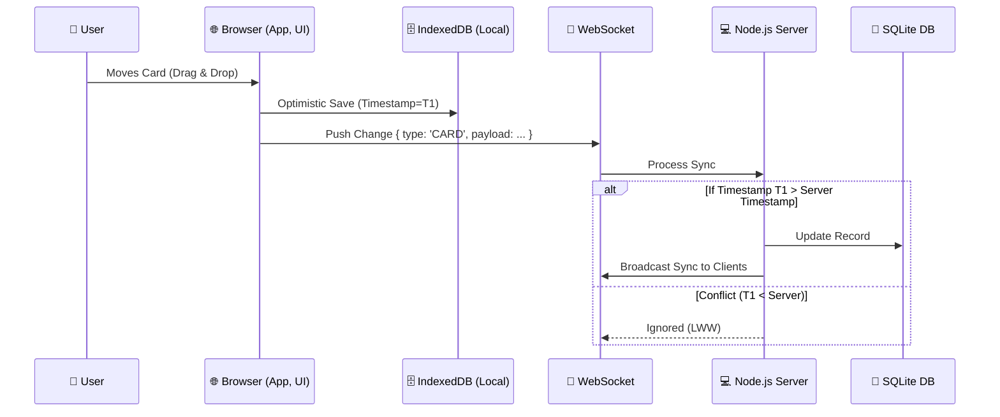

# 🚀 Collab Kanban

[](https://opensource.org/licenses/MIT)
[](https://nodejs.org)
[](https://tailwindcss.com/)
[](https://developer.mozilla.org/en-US/docs/Web/API/WebSocket)
[](https://expressjs.com/)

A lightning-fast, visually stunning, real-time collaborative Kanban board. Designed with modern web standards, featuring offline-first capabilities, optimistic UI updates, and conflict-free synchronizations based on Timestamp CRDT patterns.

<br/>

## 💎 Features
- **Sleek Glassmorphism UI**: Beautiful, modern UI driven entirely by Tailwind CSS, featuring dark mode, transparent panels, and polished drag-and-drop animations.
- **Offline First & Service Worker Background Sync**: fully functional without a network connection. Edits are queued via IndexedDB and synchronized seamlessly in the background (via Service Worker Sync API) upon reconnection.
- **Real-Time Collaboration**: Sub-millisecond state broadcasting using Native WebSockets.
- **Yjs & WebRTC Peer-to-Peer Sync**: Advanced V3 architecture featuring Yjs and WebRTC fallback for continuous sync across tabs and local networks when the WebSocket server is unreachable.
- **Live Presence**: Instantly see who else is online and viewing the board.
- **Mathematical CRDT LWW-Register**: Rigorous Last-Write-Wins (LWW) element set logic with robust ID tie-breaking, ensuring flawless convergence across distributed clients.
- **V4 Infrastructure**: Ready for production with Kubernetes manifests (Deployment, Service, Ingress), automated CI/CD pipelines via GitHub Actions, and interactive Swagger API documentation.

---

## 🛠 Built With

### Frontend Stack
*   **HTML5 & Vanilla JavaScript**: Framework-agnostic, lightweight footprint leveraging standard Web APIs (Service Workers, IndexedDB, WebSockets).
*   **Tailwind CSS (CDN)**: Utilizes the power of utility classes directly in the browser to quickly compose modern styling without the complexity of build steps.

### Backend Stack
*   **Node.js & Express.js**: High-performance HTTP server layered with global error handlers and validation middleware.
*   **WebSockets (`ws`)**: Bare-metal WebSocket implementation for maximum throughput and minimal latency.
*   **SQLite (via `sql.js`)**: In-memory database persistence with file-system backups.

---

## 📐 Architecture

Collab Kanban follows a Client-Server topology emphasizing offline resilience. 



### 🧠 Why & Trade-offs
1. **Timestamp-based LWW (Last-Write-Wins)** 
   * **Why**: Simplifies state reconciliation for small-to-medium teams. No need to ship large operational transforms (OT).
   * **Trade-off**: Concurrent edits to the exactly same field may lead to data overwriting. Granular field-level synchronization can mitigate this in larger deployments.
2. **Vanilla JS over React/Vue**
   * **Why**: Zero configuration required, minimal bundle size, completely transparent performance profiling.
   * **Trade-off**: Requires manual DOM manipulation and tracking state references (mitigated by clean, semantic HTML and well-architected JS classes).
3. **Tailwind via CDN**
   * **Why**: Drastically simplifies the setup process. Instant prototyping without waiting for Node builds or PostCSS chains.
   * **Trade-off**: You load the Tailwind JS compiler in the browser, adding minimal overhead on the first paint which is acceptable for a prototype/internal tool.

---

## 🚀 Quick Start

### Prerequisites
- Node.js `v18+` installed on your machine.

### Installation

1. **Clone the repository** (if not already local)
```bash
git clone https://github.com/your-username/collab-kanban.git
cd collab-kanban
```

2. **Install dependencies**
```bash
npm install
```

3. **Start the server**
```bash
npm start
```

4. **Visit the App**
Open your browser and navigate to `http://localhost:3000`. Open it in multiple windows or devices to see real-time synchronization in action!

---
*Built with ❤️ for architecture excellence and flawless design.*
